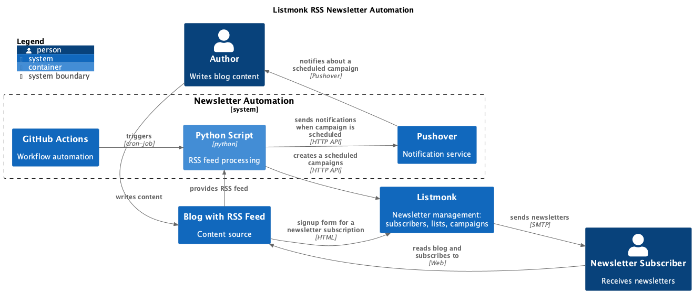
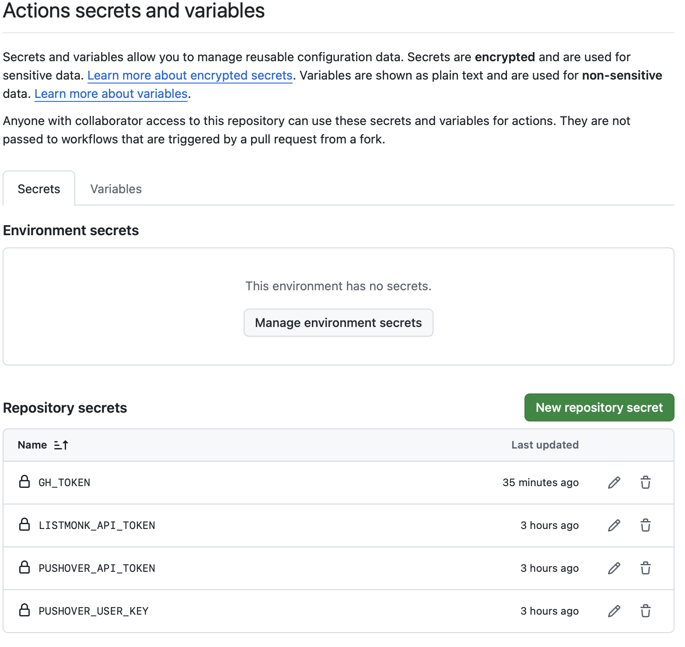
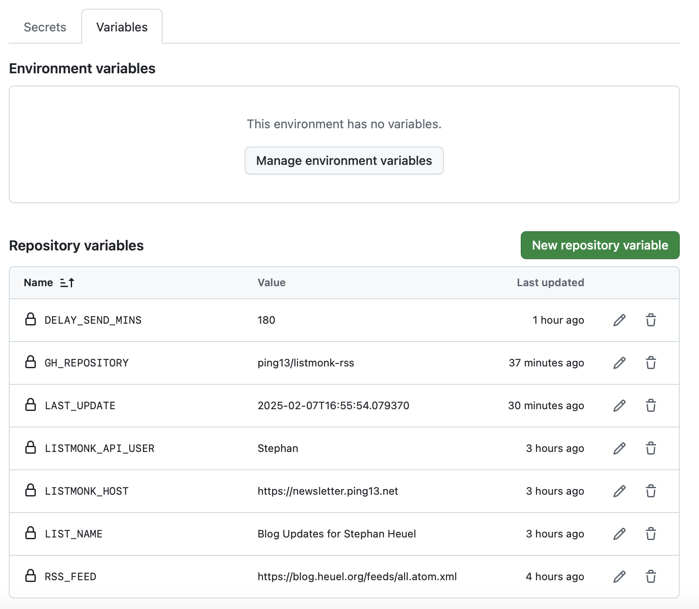

# Listmonk RSS Newsletter Automation

Automatically send newsletters from RSS feeds using [Listmonk (open
source)](https://listmonk.app) and GitHub Actions, saving money compared to
[Mailchimp](https://mailchimp.com/features/rss-to-email/) and other newsletter
providers.

## Features

- Schedule newsletter campaigns with latest update from your feed
- Automatically fetch new items from RSS feeds
- Create newsletter content based on a Markdown template for RSS feed items
- Receive push notifications when campaign is scheduled, enough time to
  edit the draft
- GitHub Actions integration for automated scheduling without the need for
  running a server

## Requirements

- A running Listmonk instance (e.g., deployed with
  [PikaPods](https://www.pikapods.com))
- GitHub account and a version of this repository
- An existing RSS feed URL, obviously

## Diagram



## Setup

### 1. Testing Setup

1. Fork this repository so that you can set up your own schedule and clone it.

2. On GitHub, Create a new repository variable `LAST_UPDATE` in your GitHub
   repo to persist the last update timestamp.

3. Create a GitHub Personal Access Token with `repo` scope at
   <https://github.com/settings/tokens>, make sure that you have the following
   permission set: *"Variables" repository permissions (write)* (we need to
   send an [API call to update a repository
   variable](https://docs.github.com/en/rest/actions/variables?apiVersion=2022-11-28#update-a-repository-variable)).

4. On your machine, install dependencies using uv:
   ```bash
   uv sync -U
   ```

5. Create a `.env` file with your configuration:
   ```bash
   LISTMONK_HOST=<your-listmonk-instance>
   LIST_NAME=<Name of your Listmonk list as it shows in the interface>
   LISTMONK_API_USER=<your_api_user>
   LISTMONK_API_TOKEN=<your_api_token>

   GH_TOKEN=<your github api token>
   GH_REPOSITORY=<yourusername>/listmonk-rss

   RSS_FEED=<your RSS feed URL>
   DELAY_SEND_MINS=45
   ```

6. Test the script locally with the environment variable below:
   ```bash
   make create_campaign
   ```

### 2. Pushover Notifications (Optional)

To receive notifications when newsletters are scheduled (this gives you an
  opportunity to review the content before it is sent out):

1. Create a Pushover account at https://pushover.net
2. Install the Pushover app on your devices
3. Get your User Key from the Pushover dashboard
4. Create an Application/API Token

Set the env variables:

```bash
PUSHOVER_USER_KEY=<your-pushover-user-key>
PUSHOVER_API_TOKEN=<your-pushover-api-token>
```

### 3. GitHub Actions Setup

Once you have setup and tested everything locally, you can move it to GitHub:

1. Add your `.env` file contents, Pushover credentials, and GitHub token as
   GitHub Secrets and Environment variables in your repository (see screenshots
   below):
   - Go to Settings → Secrets and variables → Actions
   - There is a tab "Secrets" and a tab "Variables".
   
2. The workflow is already configured in `.github/workflows/listmonk_rss.yml`
   and does the following:
   - Runs on Weekdays at 8:00 UTC, change the cron schedule as you want.
   - Persists state between runs using the repository variable (`LAST_UPDATE`),
     Uses GitHub API to store and retrieve the last processed timestamp
   - Automatically creates and schedules newsletters based on the Python
     script.

3. To manually trigger the workflow for testing:
   - Go to Actions → Listmonk RSS
   - Click "Run workflow"
   - Check in Listmonk whether the draft campaign has been created


<details>
<summary>
    
#### Screenshot "Repository Secrets"
    
</summary>



</details>

<details>
<summary>
    
#### Screenshot "Repository Variables"

</summary>



</details>

## Configuration

### Environment Variables

| Variable              | Description                                      | Required |
|-----------------------|--------------------------------------------------|----------|
| LISTMONK_API_USER     | Listmonk API username                            | Yes      |
| LISTMONK_API_TOKEN    | Listmonk API token                               | Yes      |
| LISTMONK_HOST         | Listmonk instance URL                            | Yes      |
| LIST_NAME             | Name of the mailing list in Listmonk             | Yes      |
| RSS_FEED              | URL of the RSS feed to monitor                   | Yes      |
| DELAY_SEND_MINS        | Minutes to delay sending after creation (default: 30) | No       |
| PUSHOVER_USER_KEY     | Pushover user key for notifications (optional)   | No       |
| PUSHOVER_API_TOKEN    | Pushover API token for notifications (optional)  | No       |
| GH_REPOSITORY         | GitHub repository in "owner/repo" format        | Yes      |
| GH_TOKEN              | GitHub token with repo scope for state storage  | Yes      |

### Template Customization

Edit `template.md.j2` to customize your newsletter format. The template uses Jinja2 syntax and has access to:

- `items`: List of RSS feed items with:
  - `title`: Article title
  - `link`: Article URL
  - `summary`: Article summary
  - `media_content`: OpenGraph image URL


## Related work and Contributing

This repo is inspired by
[rss2newsletter](https://github.com/ElliotKillick/rss2newsletter), but I wanted
a solution that runs without setting up a dedicated server, it just needs the
Listmonk instance and GitHub.

Contributions are welcome, but there's no guarantee that I will have the
resources to act on them. I use this repo mostly for my own purposes. My advice
would be to fork it and adjust it to your needs.

## Contact

You may want to subscribe to [my blog](https://blog.heuel.org) 😃.
